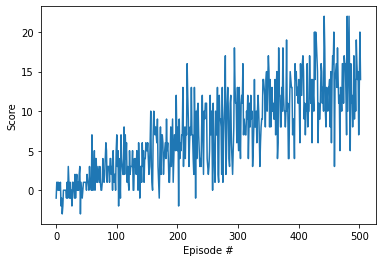

## Environment

In this project, the agent has to navigate in a large square world. A reward of +1 is provided for collecting a yellow banana, and a reward of -1 is provided for collecting a blue banana. Thus, the goal of your agent is to collect as many yellow bananas as possible while avoiding blue bananas.

The state space has 37 dimensions and contains the agent's velocity, along with ray-based perception of objects around the agent's forward direction. Given this information, the agent has to learn how to best select actions. Four discrete actions are available, corresponding to:

- 0 - move forward.
- 1 - move backward.
- 2 - turn left.
- 3 - turn right.

The task is episodic, and in order to solve the environment, your agent must get an average score of +13 over 100 consecutive episodes.

## Learning Algorithm

The agent utilizes an algorithm called Deep Q-Learning, introduced in a [paper](https://storage.googleapis.com/deepmind-media/dqn/DQNNaturePaper.pdf) by Google's DeepMind team. Just like SARSA, a more conventional reinforcement learning algorithm, Deep Q-Learning learns the action-value function of a given policy, but it includes 2 major improvements:

- Experience Replay: To avoid simply learning sequences of actions, the we use a buffer to store experience tuples (consisting of a state, action, reward and next state), then we randomly sample this buffer in the learning step. Another benefit of this technique is that rarely occuring experiences can be used for learning multiple times, effectively improving the agent's performance.
- Fixed Q-targets: Normally the Temporal Difference target is dependent on the neural network's parameters, which are being learned. This leads to instability. To avoid this, we create an identical neural net and copy the weights of the original network to it. The new network is being used to compute the TD target, while the original network gets updated in every learning step. After a few steps, the original network's parameters are copied to the new network, and the process starts over. The parameter TAU governs the weight of the old network in the copy step.

The algorithm uses Epsilon-greedy policy to choose the next action. After the action-values are computed for a given state, the agent chooses the action with the highest value with Ɛ chance, while it chooses a random action with 1-Ɛ chance. By tuning the hyperparameter Ɛ, the ratio between exploitation and exploration can be set.

## Agent Performance

When training the agent, the following hyperparameters were used:

```
BUFFER_SIZE = int(1e5)  # replay buffer size
BATCH_SIZE = 64  # minibatch size
GAMMA = 0.99  # discount factor
TAU = 1e-3  # for soft update of target parameters
LR = 5e-4  # learning rate
UPDATE_EVERY = 4  # how often to update the network
```

These parameters were taken from OpenAI's Lunar Lander example, and they worked very well in this project.

With the above hyperparameters, the training finished in 403 episodes. You can see the scores as a function of episodes during the training below:



## Future Work

The performance of the agent could be further improved by implementing the following ideas:

- [Double DQN](https://arxiv.org/abs/1509.06461)
- [Dueling DQN](https://arxiv.org/abs/1511.06581)
- [Prioritized Experience Replay](https://arxiv.org/abs/1511.05952)

Instead of using the ray-based representations of the objects around the agent, directly the pixel data could be used. This requires to replace the deep neural network with a convolutional neural network, and also the time required for training would significantly increase.
